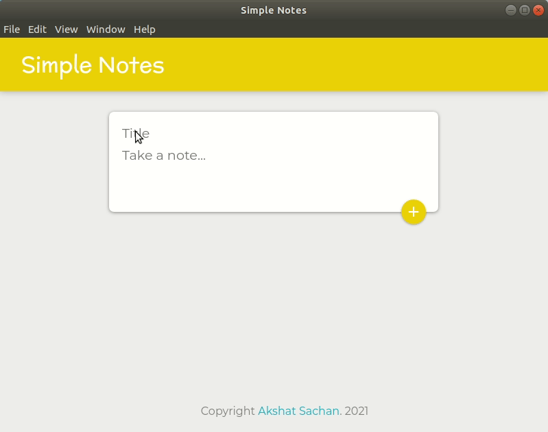

# Simple-Notes

 A simple note taking application.That allows single click creation and deletion of notes.
 

<h3 align="center">Steps to run the project on local server:</h3> 

1. run <code>npm install</code>  
2. run <code>npm start</code>  
3. run <code>npm run electron</code> 
The desktop application should be running now. 

<h3 align="center">Languages and Tools:</h3>

 
 

